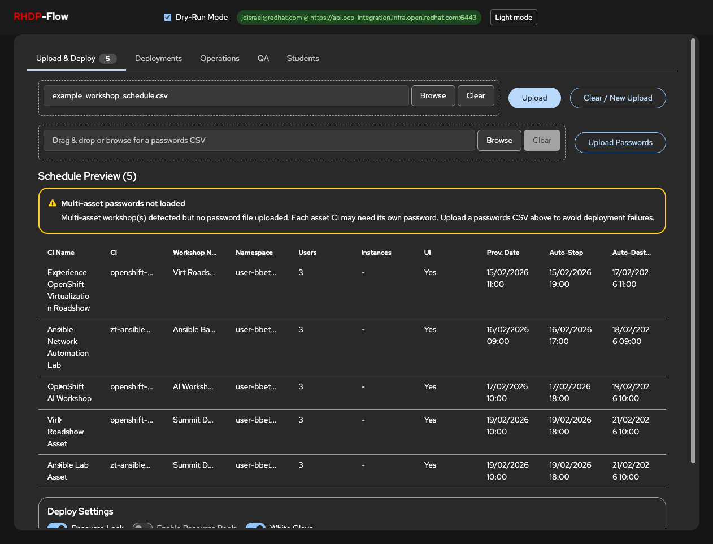
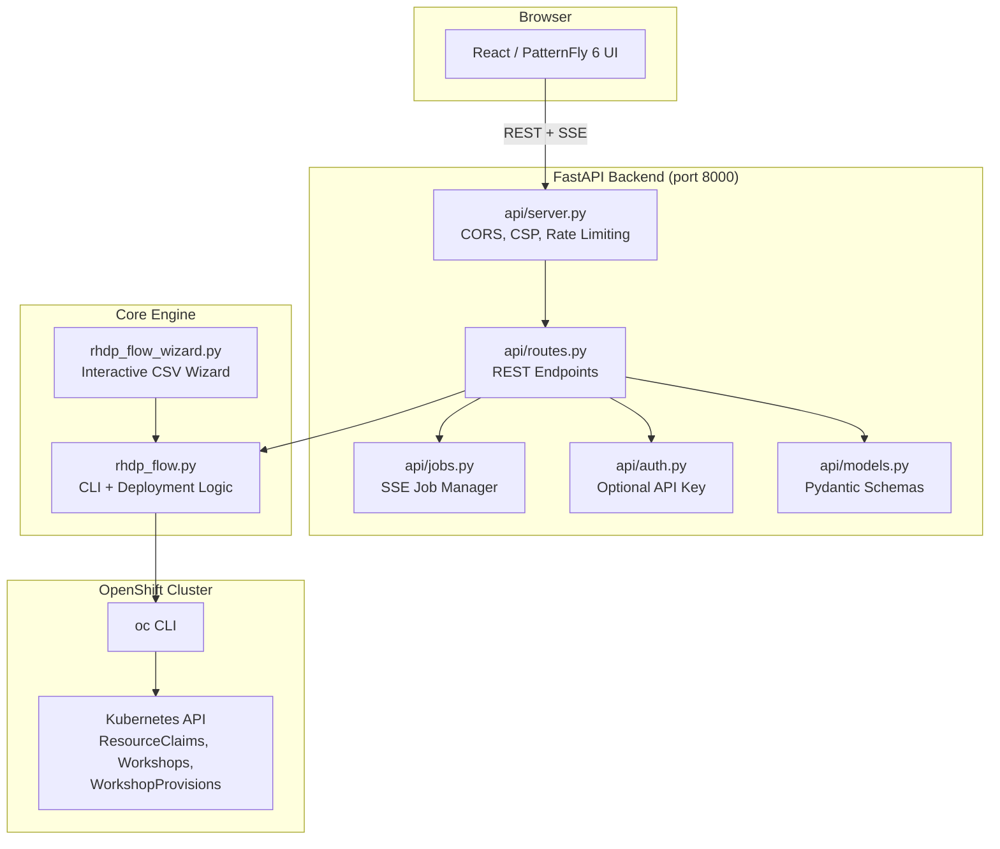

# RHDP-Flow: Red Hat Demo Platform Workshop Automation Tool

Automates scheduling, deployment, and lifecycle management for RHDP workshops — with built-in safety features to prevent costly mistakes. **Flow** = smooth, automated flow from schedule → deploy → ops.

## Quick Start

```bash
# 1. Clone
git clone git@github.com:rhjcd/rhdp-flow.git
cd rhdp-flow

# 2. Log in to the RHDP cluster
oc login <cluster-url> --token=<your-token>

# 3. Backend
python3 -m venv .venv
source .venv/bin/activate
pip install -r requirements.txt

# 4. Frontend
cd frontend && npm install && npm run build && cd ..

# 5. Run
python3 -m uvicorn api.server:app --host 127.0.0.1 --port 8000
```

Open **http://localhost:8000** in your browser.

## Features

- **Web UI** — React/PatternFly 6 frontend with five tabs: Upload & Deploy, Deployments, Operations, QA, Students
- **CSV Input** — Drag-and-drop CSV upload with inline validation warnings; [download CSV template](#csv-format) from the UI
- **Dry-Run Mode** — Preview JSON payloads without creating real resources
- **Deploy Settings** — Configurable Resource Lock, Resource Pools, White Glove, and Redirect toggles with sensible defaults
- **Cluster-Aware URLs** — Workshop and landing page URLs automatically use the domain derived from the connected cluster
- **Multi-Asset Workshops** — Group multiple CIs into a single MultiWorkshop
- **Per-Asset Passwords** — Override passwords per CI via companion CSV
- **Operations** — Lock, extend (stop/destroy), and scale running workshops
- **QA Verification** — Verify setup (dates/users) and deployment health (seats/URLs)
- **Results Export** — CSV export with GUIDs and student landing page URLs; clickable hyperlinks in Deployments and Students tabs
- **Retry & Bulk Operations** — Retry failed deployments individually or in bulk via checkbox selection
- **Schedule Diff** — Compare a new CSV against loaded schedules to see added, removed, and changed rows
- **Keyboard Shortcuts** — Press `1`-`5` for tabs, `?` for help overlay
- **URL Routing** — Tab state synced to URL hash (`#deployments`, `#operations`, etc.) for bookmarking and browser back/forward
- **Sortable & Paginated Tables** — Column sorting, pagination (default 20/page), sticky headers across all tabs
- **Search & Filter** — Search inputs on schedule preview, deployments, and operations history; status toggle filters on deployments
- **Security** — Optional API key auth, CORS restrictions, CSP headers, rate limiting. See [docs/SECURITY.md](docs/SECURITY.md)
- **CLI** — Direct command-line deployment and an interactive wizard (`--wizard`)
- **Risk Prevention** — 13 built-in safeguards (confirmation modals, date validation, live-mode warnings). See [docs/RISK-PREVENTION.md](docs/RISK-PREVENTION.md) for details and screenshots
- **Test Suite** — 173 backend tests (pytest) + 47 frontend tests (Vitest + React Testing Library)

## Requirements

| Requirement | Version | Notes |
|-------------|---------|-------|
| Python | 3.9+ | |
| Node.js | 18+ | includes npm |
| OpenShift CLI (`oc`) | 4.x | must be logged in to the RHDP cluster |

## Installation

### macOS

```bash
# Python (comes pre-installed, or use Homebrew)
brew install python3

# Node.js
brew install node

# OpenShift CLI
brew install openshift-cli

# Clone and set up
git clone git@github.com:rhjcd/rhdp-flow.git
cd rhdp-flow

python3 -m venv .venv
source .venv/bin/activate
pip install -r requirements.txt

cd frontend
npm install
cd ..
```

### Linux (RHEL / Fedora)

```bash
# Python + venv
sudo dnf install python3 python3-pip python3-virtualenv

# Node.js (via NodeSource or dnf)
sudo dnf install nodejs npm

# OpenShift CLI — download from https://mirror.openshift.com/pub/openshift-v4/clients/ocp/latest/
# or extract from your cluster's "Command Line Tools" page

# Clone and set up
git clone git@github.com:rhjcd/rhdp-flow.git
cd rhdp-flow

python3 -m venv .venv
source .venv/bin/activate
pip install -r requirements.txt

cd frontend
npm install
cd ..
```

### Linux (Ubuntu / Debian)

```bash
# Python + venv
sudo apt update
sudo apt install python3 python3-pip python3-venv

# Node.js (via NodeSource)
curl -fsSL https://deb.nodesource.com/setup_20.x | sudo -E bash -
sudo apt install nodejs

# Clone and set up (same as above)
git clone git@github.com:rhpds/rhpds-utils.git
cd rhpds-utils/RHDP-Scheduler

python3 -m venv .venv
source .venv/bin/activate
pip install -r requirements.txt

cd frontend
npm install
cd ..
```

## Running the Web UI

**Before starting**, make sure you are logged in to the RHDP cluster:

```bash
oc login https://api.your-cluster.example.com:6443 --token=sha256~your-token
oc whoami   # should show your user
```

### Production Mode (single server)

Build the frontend once, then run the API server — it serves both the API and the built React app:

```bash
cd frontend && npm run build && cd ..
source .venv/bin/activate
python3 -m uvicorn api.server:app --host 127.0.0.1 --port 8000
```

Open **http://localhost:8000** in your browser.

### Development Mode (two terminals)

Open **two terminals** from the `RHDP-Scheduler` directory:

**Terminal 1 — API server** (port 8000):

```bash
source .venv/bin/activate
python3 -m uvicorn api.server:app --host 127.0.0.1 --port 8000
```

**Terminal 2 — Frontend dev server** (port 5173, proxies `/api` to backend):

```bash
cd frontend
npm run dev
```

Open **http://localhost:5173** in your browser.

The masthead shows a green "Connected" badge when the backend and cluster are reachable. Workshop URLs are automatically derived from the connected cluster (e.g., `integration.demo.redhat.com` from `api.integration.demo.redhat.com:6443`).

### Deploy Settings

After uploading a CSV, the **Deploy Settings** card appears with three toggles:

| Setting | Default | Description |
|---------|---------|-------------|
| Resource Lock | On | Apply `demo.redhat.com/lock-enabled` label to prevent accidental deletion |
| Enable Resource Pools | Off | Enable Poolboy resource pool allocation |
| White Glove | On | Apply white-glove label for managed workshops |



## CSV Format

Parsed by `read_csv_input()` in `rhdp_flow.py`. **Column order does not matter.** Header names are **case-insensitive**. Optional **`Archive`** column is always ignored.

**Dates:** `DD/MM/YYYY HH:MM` (UTC-style headers recommended). Use **either** all legacy **or** all `(UTC)` date headers—see required table below.

### Required columns

| Column | Notes |
|--------|--------|
| `CI Name`, `CI`, `Namespace` | Workshop label, catalog item ID, target namespace |
| `Users` | Header **required**; cell may be **empty** (no `num_users` from CSV—catalog defaults may still apply) |
| `Enable_workshop_interface` | `True` / `False` / `Yes` / `No` / `1` / `0` |
| `Password`, `Activity`, `Purpose` | `Activity` / `Purpose` default to `Admin` / `QA` if the cell is blank |
| **Dates (pick one set)** | **Legacy:** `Provisioning Date`, `Auto-stop`, `Auto-destroy` — **or** **UTC:** `Provisioning Date (UTC)`, `Auto-stop (UTC)`, `Auto-destroy (UTC)` |

### Users, Instances, and Count (read this first)

1. **`Users`** — When the cell has a number **> 0**, it becomes **`num_users`** on the ResourceClaim. This is the seat count the **catalog** cares about for limits (see below). Empty `Users` = do not set `num_users` from the CSV.

2. **`Enable_workshop_interface` = False** (single workshop, “backend only”) — Only a **ResourceClaim** is created. **`Instances` is not used** for that row. Set seats with **`Users`** (or catalog defaults).

3. **`Enable_workshop_interface` = True** or **multi-asset** — The tool may create **Workshop** / **WorkshopProvision** / **MultiWorkshop**. Then **`Instances`** controls **WorkshopProvision `spec.count`** (how many provision replicas) when that path runs; if **`Instances`** is blank, **`spec.count` defaults to `1`**. **`MultiWorkshop`** `numberSeats` is set from **`Users`** or **`Instances`** when those are positive.

4. **`Count`** — If **> 1**, one CSV row becomes **N identical schedules** (N separate deployments). This is **not** the same as “seats per workshop” and does not replace **`Instances`**.

Only the column name **`Instances`** is read for workshop-instance count (no `Workshop_instance_count`).

### Catalog `num_users` maximum (e.g. Virt roadshow cap 20)

Many catalog items declare a **maximum** for **`num_users`**. When the cluster is reachable:

- After **CSV upload**, the UI calls **`POST /api/schedules/validate-num-users`**, compares each row’s **`Users`** to the catalog max, and shows a **red alert** if over limit (multi-asset asset CIs are checked too).
- **Live deploy** is **blocked** in the UI and returns **400** from **`POST /api/deploy`** if any schedule has **`Users`** above the max. The CLI **`process_schedule`** path fails the row with the same check (non–dry-run).
- **Dry-run deploy** still runs so you can inspect YAML even when over limit.
- Validation uses the **`Users`** column only today—not **`Instances`**.

To run **40 seats** when the catalog allows **20** per claim, model it explicitly: e.g. **two rows** (or **`Count` = 2** with **`Users` = 20** each), or one row per namespace—whatever matches how you want **separate ResourceClaims** and billing. The tool does **not** auto-split one row into “2×20” for you.

### Optional columns

| Column | Role |
|--------|------|
| `Workshop Name` | Overrides display name (default: `CI Name`) |
| `Multi_Asset`, `Asset_CIs` | Legacy multi-asset (one row, many CIs) |
| `Multi_Workshop_Name` | New-style multi-asset: same name on each row, one CI per row |
| `Concurrency` | WorkshopProvision concurrency (default 1) |
| `Instances` | WorkshopProvision / MultiWorkshop seating path (see above) |
| `Salesforce IDs` | Chargeback; `;`-separated; optional `type:id` (alias header: `campaign_id`) |
| `Salesforce_Type` | Default type for plain IDs: `opportunity`, `campaign`, `project`, `cdh` |
| `Count` | Expand row into N deployments |
| `AWS_Region` | Comma-separated regions for multi-region |
| `Redirect` | Per-row lab redirect; `False` / `0` / `No` / `N` off (global UI toggle still affects uploads) |
| `Showroom_Repo`, `Showroom_Ref`, `Showroom_NoVNC`, `Showroom_Zerotouch` | Showroom lab content |

**Not in CSV:** **White Glove** — only Deploy Settings / API / CLI config. Extra columns (e.g. `White_Glove`) are ignored by the parser.

### Catalog Namespace Auto-Detection

Flow automatically determines which catalog namespace to use based on your catalog item (CI) suffix:

| CI Suffix | Catalog Namespace | Example |
|-----------|-------------------|---------|
| `.event` | `babylon-catalog-event` | `summit-2026.lb1234.event` |
| `.prod` | `babylon-catalog-prod` | `openshift-cnv.ocp-virt-roadshow.prod` |
| `.dev` | `babylon-catalog-dev` | `test-workshop.dev` |
| *(no suffix)* | `babylon-catalog-prod` (default) | `legacy-workshop-name` |

**Manual Override:** Add an optional `Catalog_Namespace` column to your CSV to explicitly specify the namespace:

```csv
CI Name,CI,Namespace,Catalog_Namespace,...
Workshop A,summit-2026.lb1234.event,user-alice,babylon-catalog-event,...
Workshop B,custom.workshop,user-bob,babylon-catalog-dev,...
```

**Why This Matters:** If the catalog namespace is wrong, workshops will be created as "ghosts" — stuck with `PHASE: <none>` and `provisioningCount: 0`. This wastes cluster resources and requires manual cleanup.

**Validation:** During dry-run mode (`--dry-run` or Deploy Settings → Dry-Run Mode), Flow validates that each catalog item exists in its expected namespace. Mismatches can occur if:
- You manually override `Catalog_Namespace` to the wrong namespace
- Your CI doesn't have a recognized suffix (defaults to prod)

**Example 1 - Manual override error:**
```
❌ Workshop: Item 'summit-2026.lb1234.event' not found in babylon-catalog-prod.
   Found in babylon-catalog-event instead. Remove Catalog_Namespace column 
   to use auto-detection, or set it to babylon-catalog-event.
```

**Example 2 - Missing suffix:**
```
❌ Workshop: Item 'legacy-workshop-name' not found in babylon-catalog-prod.
   Found in babylon-catalog-event instead. Add .event suffix to CI name, 
   or set Catalog_Namespace=babylon-catalog-event in CSV.
```

**Troubleshooting Ghost Workshops:**

1. **Check the catalog namespace** in your CSV or via auto-detection
2. **Verify the catalog item exists**: `oc get catalogitem <CI> -n <namespace>`
3. **Run dry-run mode** before deploying to catch namespace mismatches early
4. **Clean up ghosts**: Delete stale WorkshopProvisions with `oc delete workshopprovision <name> -n <namespace>`

---

## Cluster-Tenant Workshops

Some catalog items are available in **two variants** that differ in their infrastructure architecture:

- **Cluster variant** (`-cluster` suffix): Provisions a dedicated OpenShift cluster with workloads pre-installed
- **Tenant variant** (`-tenant` suffix): Provisions tenant workloads on a shared base cluster via Sandbox API

### Architecture Pattern

**Cluster deployment:**
```
ResourceClaim → Full OpenShift cluster → Workloads installed on cluster
```

**Tenant deployment:**
```
ResourceClaim → Shared cluster infrastructure (pre-provisioned)
             → Sandbox API request → Tenant namespace + workloads
```

### When to Use Each Variant

| Variant | Use Case | Cost | Provision Time | Resource Isolation |
|---------|----------|------|----------------|-------------------|
| **Cluster** | Full control, custom cluster config, production testing | Higher | 45-60 min | Complete (dedicated cluster) |
| **Tenant** | Workshops, demos, quick starts, learning labs | Lower | 5-15 min | Namespace-level (shared cluster) |

### Catalog Item Examples

From the `ai-quickstarts` family:

| Cluster Variant | Tenant Variant | Description |
|----------------|----------------|-------------|
| `ai-quickstarts.ai-qs-data-gov-cluster.event` | `ai-quickstarts.ai-qs-data-gov-tenant.event` | Data Governance Copilot |
| `ai-quickstarts.ai-qs-it-self-service-cluster.event` | `ai-quickstarts.ai-qs-it-self-service-tenant.event` | IT Self-Service Chatbot |
| `ai-quickstarts.ai-qs-product-rec-cluster.event` | `ai-quickstarts.ai-qs-product-rec-tenant.event` | Product Recommender |
| `ai-quickstarts.ai-qs-rag-cluster.event` | `ai-quickstarts.ai-qs-rag-tenant.event` | RAG (Retrieval-Augmented Generation) |
| `ai-quickstarts.ai-qs-ppe-comp-cluster.event` | `ai-quickstarts.ai-qs-ppe-comp-tenant.event` | PPE Monitoring with Computer Vision |

### CSV Format

Use the catalog item ID with the appropriate suffix. Flow treats them as standard catalog items—no special columns required.

**Example - Tenant variant (recommended for workshops):**
```csv
CI Name,CI,Namespace,Users,Enable_workshop_interface,Password,Activity,Purpose,Provisioning Date (UTC),Auto-stop (UTC),Auto-destroy (UTC)
Data Gov Demo,ai-quickstarts.ai-qs-data-gov-tenant.event,user-alice,1,True,demo123,Admin,QA,25/03/2026 10:00,25/03/2026 18:00,26/03/2026 10:00
```

**Example - Cluster variant (for full cluster testing):**
```csv
CI Name,CI,Namespace,Users,Enable_workshop_interface,Password,Activity,Purpose,Provisioning Date (UTC),Auto-stop (UTC),Auto-destroy (UTC)
Data Gov Full,ai-quickstarts.ai-qs-data-gov-cluster.event,user-bob,1,True,cluster456,Admin,QA,25/03/2026 10:00,27/03/2026 18:00,28/03/2026 10:00
```

### Validation & Best Practices

1. **Check catalog item existence** before deploying:
   ```bash
   oc get catalogitem ai-quickstarts.ai-qs-data-gov-tenant.event -n babylon-catalog-event
   ```

2. **Use tenant variants for events** (Summit, workshops, demos):
   - Faster provisioning (5-15 min vs 45-60 min)
   - Lower cost
   - Sufficient isolation for learning environments

3. **Use cluster variants when you need**:
   - Custom cluster configuration
   - Full cluster admin access
   - Testing cluster-level features
   - Production-like environments

4. **Stagger tenant deployments** during events to avoid Sandbox API throttling:
   ```csv
   Provisioning Date (UTC)
   07/05/2026 09:00
   07/05/2026 09:05  ← 5-minute gap
   07/05/2026 09:10  ← recommended: 5-10 minute intervals
   ```

### Troubleshooting

| Problem | Cause | Fix |
|---------|-------|-----|
| Tenant provision stuck | Sandbox API quota exceeded | Stagger deployments with 5-10 min gaps |
| Wrong variant deployed | Typo in CI suffix | Verify `-cluster` vs `-tenant` in CSV |
| Cluster provision too slow | Full cluster takes 45-60 min | Use tenant variant for workshops |
| Resource not found | Catalog item doesn't exist | Check `oc get catalogitem -n babylon-catalog-event` |

### Resource Labels

Flow automatically applies these labels to all workshops (both cluster and tenant):

```yaml
metadata:
  labels:
    rhdp-flow.gpte.redhat.com/scheduled: "true"
    demo.redhat.com/lock-enabled: "true"  # when Resource Lock is on
```

Tenant-variant resources also get Sandbox API labels from the provisioner (not set by Flow).

---

### Full header checklist

```
CI Name,CI,Namespace,Users,Enable_workshop_interface,Password,Activity,Purpose,Workshop Name,Provisioning Date (UTC),Auto-stop (UTC),Auto-destroy (UTC),Multi_Asset,Asset_CIs,Multi_Workshop_Name,Concurrency,Instances,Salesforce IDs,Salesforce_Type,Count,AWS_Region,Redirect,Showroom_Repo,Showroom_Ref,Showroom_NoVNC,Showroom_Zerotouch
```

Use **Download CSV Template** in the UI or **`GET /api/templates/schedule`**.

See **sample-csvs/** and **docs/examples/** for more:

- **sample-csvs:** `multi-asset-event-v2.csv`, `multi_asset_grouped.csv`, `dedicated_per_user.csv`, `asset_passwords_example.csv`
- **docs/examples:** [README](docs/examples/README.md) — minimal_workshop, count_expansion, multi_region, no_auto_stop, event_catalog_item, salesforce_multi_type, two_workshops_same_namespace, and more

## CLI Usage

### Dry-Run (Safe Preview)

```bash
python3 rhdp_flow.py --input-csv workshop_schedule.csv --dry-run
```

### Actual Deployment

```bash
python3 rhdp_flow.py --input-csv workshop_schedule.csv
```

### Filter by Catalog Item

```bash
python3 rhdp_flow.py --input-csv workshop_schedule.csv --ci openshift-cnv.ocp-virt-roadshow-multi-user.prod
```

### Interactive Wizard

```bash
python3 rhdp_flow.py --wizard
```

### Operations

```bash
# Lock workshops (set stop time to now)
python3 rhdp_flow.py --input-csv workshop_schedule.csv --lock

# Extend stop time
python3 rhdp_flow.py --input-csv workshop_schedule.csv --extend-stop --days 1 --hours 4

# Extend destroy time
python3 rhdp_flow.py --input-csv workshop_schedule.csv --extend-destroy --days 2

# Scale seats
python3 rhdp_flow.py --input-csv workshop_schedule.csv --scale 40
```

### QA Verification

```bash
# Verify setup (dates, users)
python3 rhdp_flow.py --input-csv workshop_schedule.csv --qa 1

# Verify deployment health (seats, URLs)
python3 rhdp_flow.py --input-csv workshop_schedule.csv --qa 2

# Run both
python3 rhdp_flow.py --input-csv workshop_schedule.csv --qa both
```

## Per-Asset Passwords

Multi-asset workshops can override passwords per CI using a companion CSV with `CI,Password` columns.

**Web UI**: Use the "Upload Passwords" button on the Upload & Deploy tab before deploying.

**CLI**: Place a `{input_stem}_passwords.csv` alongside your input CSV:

```csv
CI,Password
openshift-cnv.ocp-virt-roadshow-multi-user.prod,VirtSecret1
zt-ansiblebu.ansible-network-automation-basics-lab-2.event,AnsibleSecret2
```

## Command Line Arguments

| Flag | Description |
|------|-------------|
| `--input-csv` | Path to input CSV file (required unless `--wizard`) |
| `--output-csv` | Output CSV path (default: `deployment_results.csv`). The written file includes a **password** column from the input schedule; treat exports as sensitive. |
| `--ci` | Filter to specific Catalog Item ID |
| `--dry-run` | Preview payloads without creating resources |
| `--kubeconfig` | Path to kubeconfig file |
| `--timeout` | Command timeout in seconds (default: 60) |
| `--debug` | Enable debug logging |
| `--wizard` | Launch interactive CSV wizard |
| `--qa {1,2,both}` | Run QA verification |
| `--lock` | Lock workshops (stop now) |
| `--extend-stop` | Extend auto-stop time |
| `--extend-destroy` | Extend auto-destroy time |
| `--days` | Days to extend (with `--extend-*`) |
| `--hours` | Hours to extend (with `--extend-*`) |
| `--scale N` | Scale WorkshopProvision seat count |

## API Documentation

The backend exposes interactive API docs powered by FastAPI:

- **Swagger UI**: http://localhost:8000/docs
- **ReDoc**: http://localhost:8000/redoc

All endpoints are available under `/api/` (backward-compatible) and `/api/v1/`.

## Architecture



## Project Structure

```
RHDP-Scheduler/
├── api/                  # FastAPI backend
│   ├── server.py         # App setup, CORS, CSP, static file serving
│   ├── routes.py         # REST endpoints (upload, deploy, operations, QA, export)
│   ├── models.py         # Pydantic request/response schemas
│   ├── jobs.py           # Async job manager with SSE streaming
│   └── auth.py           # Optional API key authentication
├── frontend/             # React/Vite/TypeScript UI
│   └── src/
│       ├── components/   # Tab components (UploadTab, DeploymentsTab, etc.)
│       ├── hooks/        # Custom hooks (useAutoRefresh, useKeyboardShortcuts)
│       ├── services/     # API client
│       └── test/         # Test setup, mocks, component tests
├── tests/                # Backend pytest suite (77 tests)
├── sample-csvs/          # Example schedule and password CSVs
├── docs/                 # Risk prevention, security, usage docs + screenshots
├── rhdp_flow.py          # CLI entry point + core deployment engine
├── rhdp_flow_wizard.py   # Interactive CSV wizard
└── requirements.txt      # Python dependencies
```

## Testing

### Backend Tests

```bash
source .venv/bin/activate
python -m pytest tests/ -v
```

Backend tests cover API endpoints, CSV parsing (including Count, AWS_Region, Salesforce type, load_asset_passwords, load_asset_num_users), date handling, derive_base_domain, build_resource_claim_payload, and models. Run: `python -m pytest tests/ -v`

### Frontend Tests

```bash
cd frontend
npm test              # single run
npm run test:watch    # watch mode
npm run test:coverage # with coverage report
```

36 tests covering all tab components, health badge, and app smoke tests.

## Troubleshooting

| Problem | Fix |
|---------|-----|
| Masthead shows red "Disconnected" | Make sure the API server is running on port 8000 |
| `oc` commands fail | Run `oc login` and verify with `oc whoami` |
| `ModuleNotFoundError` | Activate the venv: `source .venv/bin/activate` |
| Frontend won't start | Run `npm install` in the `frontend/` directory |
| Port 5173 in use | Vite will auto-pick the next port (check terminal output) |

## Authors

**Josh Disraeli**, **Billy Bethell** — White Glove / RHDP team. Equal maintainers; Josh has driven much of the recent development (Web UI, operations, QA, examples, and tests).

## License

Internal Red Hat tool for RHDP automation.
