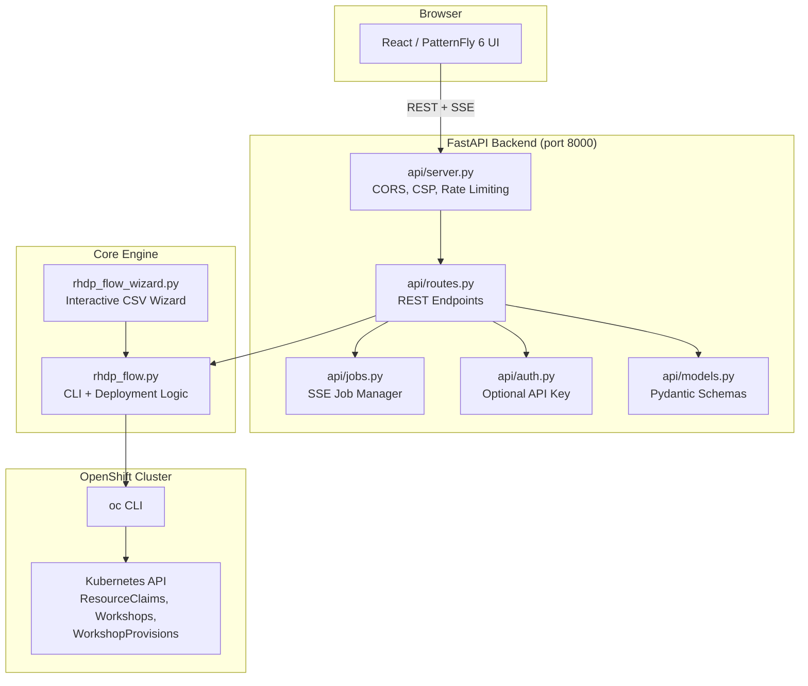

# RHDP-Flow: Red Hat Demo Platform Workshop Automation Tool

Automates scheduling, deployment, and lifecycle management for RHDP workshops — with built-in safety features to prevent costly mistakes. **Flow** = smooth, automated flow from schedule → deploy → ops.

## Quick Start

```bash
# 1. Clone
git clone git@github.com:rhpds/rhpds-utils.git
cd rhpds-utils/RHDP-Scheduler

# 2. Log in to the RHDP cluster
oc login <cluster-url> --token=<your-token>

# 3. Backend
python3 -m venv .venv
source .venv/bin/activate
pip install -r requirements.txt

# 4. Frontend
cd frontend && npm install && npm run build && cd ..

# 5. Run
python3 -m uvicorn api.server:app --host 127.0.0.1 --port 8000
```

Open **http://localhost:8000** in your browser.

## Features

- **Web UI** — React/PatternFly 6 frontend with five tabs: Upload & Deploy, Deployments, Operations, QA, Students
- **CSV Input** — Drag-and-drop CSV upload with inline validation warnings; [download CSV template](#csv-format) from the UI
- **Dry-Run Mode** — Preview JSON payloads without creating real resources
- **Deploy Settings** — Configurable Resource Lock, Resource Pools, White Glove, and Redirect toggles with sensible defaults
- **Cluster-Aware URLs** — Workshop and landing page URLs automatically use the domain derived from the connected cluster
- **Multi-Asset Workshops** — Group multiple CIs into a single MultiWorkshop
- **Per-Asset Passwords** — Override passwords per CI via companion CSV
- **Operations** — Lock, extend (stop/destroy), and scale running workshops
- **QA Verification** — Verify setup (dates/users) and deployment health (seats/URLs)
- **Results Export** — CSV export with GUIDs and student landing page URLs; clickable hyperlinks in Deployments and Students tabs
- **Retry & Bulk Operations** — Retry failed deployments individually or in bulk via checkbox selection
- **Schedule Diff** — Compare a new CSV against loaded schedules to see added, removed, and changed rows
- **Keyboard Shortcuts** — Press `1`-`5` for tabs, `?` for help overlay
- **URL Routing** — Tab state synced to URL hash (`#deployments`, `#operations`, etc.) for bookmarking and browser back/forward
- **Sortable & Paginated Tables** — Column sorting, pagination (default 20/page), sticky headers across all tabs
- **Search & Filter** — Search inputs on schedule preview, deployments, and operations history; status toggle filters on deployments
- **Security** — Optional API key auth, CORS restrictions, CSP headers, rate limiting. See [docs/SECURITY.md](docs/SECURITY.md)
- **CLI** — Direct command-line deployment and an interactive wizard (`--wizard`)
- **Risk Prevention** — 13 built-in safeguards (confirmation modals, date validation, live-mode warnings). See [docs/RISK-PREVENTION.md](docs/RISK-PREVENTION.md) for details and screenshots
- **Test Suite** — 77 backend tests (pytest) + 36 frontend tests (Vitest + React Testing Library)

## Requirements

| Requirement | Version | Notes |
|-------------|---------|-------|
| Python | 3.9+ | |
| Node.js | 18+ | includes npm |
| OpenShift CLI (`oc`) | 4.x | must be logged in to the RHDP cluster |

## Installation

### macOS

```bash
# Python (comes pre-installed, or use Homebrew)
brew install python3

# Node.js
brew install node

# OpenShift CLI
brew install openshift-cli

# Clone and set up
git clone git@github.com:rhpds/rhpds-utils.git
cd rhpds-utils/RHDP-Scheduler

python3 -m venv .venv
source .venv/bin/activate
pip install -r requirements.txt

cd frontend
npm install
cd ..
```

### Linux (RHEL / Fedora)

```bash
# Python + venv
sudo dnf install python3 python3-pip python3-virtualenv

# Node.js (via NodeSource or dnf)
sudo dnf install nodejs npm

# OpenShift CLI — download from https://mirror.openshift.com/pub/openshift-v4/clients/ocp/latest/
# or extract from your cluster's "Command Line Tools" page

# Clone and set up
git clone git@github.com:rhpds/rhpds-utils.git
cd rhpds-utils/RHDP-Scheduler

python3 -m venv .venv
source .venv/bin/activate
pip install -r requirements.txt

cd frontend
npm install
cd ..
```

### Linux (Ubuntu / Debian)

```bash
# Python + venv
sudo apt update
sudo apt install python3 python3-pip python3-venv

# Node.js (via NodeSource)
curl -fsSL https://deb.nodesource.com/setup_20.x | sudo -E bash -
sudo apt install nodejs

# Clone and set up (same as above)
git clone git@github.com:rhpds/rhpds-utils.git
cd rhpds-utils/RHDP-Scheduler

python3 -m venv .venv
source .venv/bin/activate
pip install -r requirements.txt

cd frontend
npm install
cd ..
```

## Running the Web UI

**Before starting**, make sure you are logged in to the RHDP cluster:

```bash
oc login https://api.your-cluster.example.com:6443 --token=sha256~your-token
oc whoami   # should show your user
```

### Production Mode (single server)

Build the frontend once, then run the API server — it serves both the API and the built React app:

```bash
cd frontend && npm run build && cd ..
source .venv/bin/activate
python3 -m uvicorn api.server:app --host 127.0.0.1 --port 8000
```

Open **http://localhost:8000** in your browser.

### Development Mode (two terminals)

Open **two terminals** from the `RHDP-Scheduler` directory:

**Terminal 1 — API server** (port 8000):

```bash
source .venv/bin/activate
python3 -m uvicorn api.server:app --host 127.0.0.1 --port 8000
```

**Terminal 2 — Frontend dev server** (port 5173, proxies `/api` to backend):

```bash
cd frontend
npm run dev
```

Open **http://localhost:5173** in your browser.

The masthead shows a green "Connected" badge when the backend and cluster are reachable. Workshop URLs are automatically derived from the connected cluster (e.g., `integration.demo.redhat.com` from `api.integration.demo.redhat.com:6443`).

### Deploy Settings

After uploading a CSV, the **Deploy Settings** card appears with three toggles:

| Setting | Default | Description |
|---------|---------|-------------|
| Resource Lock | On | Apply `demo.redhat.com/lock-enabled` label to prevent accidental deletion |
| Enable Resource Pools | Off | Enable Poolboy resource pool allocation |
| White Glove | On | Apply white-glove label for managed workshops |


## CSV Format

The schedule CSV uses these columns (order doesn't matter, column names are case-insensitive):

```
CI Name, CI, Namespace, Users, Enable_workshop_interface, Password,
Activity, Purpose, Salesforce IDs, Workshop Name,
Provisioning Date (UTC), Auto-stop (UTC), Auto-destroy (UTC),
Multi_Asset, Asset_CIs, Multi_Workshop_Name, Instances, Concurrency
```

| Column | Required | Description |
|--------|----------|-------------|
| CI Name | Yes | Friendly display name |
| CI | Yes | Catalog Item ID (e.g. `openshift-cnv.ocp-virt-roadshow-multi-user.prod`) |
| Namespace | Yes | Target namespace (e.g. `user-bbethell-redhat-com`) |
| Users | No | Number of users/seats per workshop |
| Enable_workshop_interface | No | `True` / `False` — enable the student UI |
| Password | No | Workshop password |
| Activity | No | Activity label |
| Purpose | No | Purpose label |
| Salesforce IDs | No | Salesforce campaign/opportunity IDs for chargeback |
| Workshop Name | No | Display name for the workshop provision |
| Provisioning Date (UTC) | Yes | `DD/MM/YYYY HH:MM` format |
| Auto-stop (UTC) | Yes | When to stop the workshop |
| Auto-destroy (UTC) | Yes | When to destroy resources |
| Multi_Asset | No | `True` if this is a multi-asset workshop |
| Asset_CIs | No | Comma-separated CIs for multi-asset workshops |
| Multi_Workshop_Name | No | Name for the grouped MultiWorkshop |
| Instances | No | Total seat/instance count (used for multi-asset numberSeats) |
| Concurrency | No | WorkshopProvision concurrency (default 1) |

See **sample-csvs/** for working examples and **docs/examples/** for more:

- **sample-csvs:** `multi-asset-event-v2.csv`, `multi_asset_grouped.csv`, `dedicated_per_user.csv`, `asset_passwords_example.csv`
- **docs/examples:** [README](docs/examples/README.md) — minimal_workshop, count_expansion, multi_region, no_auto_stop, event_catalog_item, salesforce_multi_type, two_workshops_same_namespace, and more

## CLI Usage

### Dry-Run (Safe Preview)

```bash
python3 rhdp_flow.py --input-csv workshop_schedule.csv --dry-run
```

### Actual Deployment

```bash
python3 rhdp_flow.py --input-csv workshop_schedule.csv
```

### Filter by Catalog Item

```bash
python3 rhdp_flow.py --input-csv workshop_schedule.csv --ci openshift-cnv.ocp-virt-roadshow-multi-user.prod
```

### Interactive Wizard

```bash
python3 rhdp_flow.py --wizard
```

### Operations

```bash
# Lock workshops (set stop time to now)
python3 rhdp_flow.py --input-csv workshop_schedule.csv --lock

# Extend stop time
python3 rhdp_flow.py --input-csv workshop_schedule.csv --extend-stop --days 1 --hours 4

# Extend destroy time
python3 rhdp_flow.py --input-csv workshop_schedule.csv --extend-destroy --days 2

# Scale seats
python3 rhdp_flow.py --input-csv workshop_schedule.csv --scale 40
```

### QA Verification

```bash
# Verify setup (dates, users)
python3 rhdp_flow.py --input-csv workshop_schedule.csv --qa 1

# Verify deployment health (seats, URLs)
python3 rhdp_flow.py --input-csv workshop_schedule.csv --qa 2

# Run both
python3 rhdp_flow.py --input-csv workshop_schedule.csv --qa both
```

## Per-Asset Passwords

Multi-asset workshops can override passwords per CI using a companion CSV with `CI,Password` columns.

**Web UI**: Use the "Upload Passwords" button on the Upload & Deploy tab before deploying.

**CLI**: Place a `{input_stem}_passwords.csv` alongside your input CSV:

```csv
CI,Password
openshift-cnv.ocp-virt-roadshow-multi-user.prod,VirtSecret1
zt-ansiblebu.ansible-network-automation-basics-lab-2.event,AnsibleSecret2
```

## Command Line Arguments

| Flag | Description |
|------|-------------|
| `--input-csv` | Path to input CSV file (required unless `--wizard`) |
| `--output-csv` | Output CSV path (default: `deployment_results.csv`) |
| `--ci` | Filter to specific Catalog Item ID |
| `--dry-run` | Preview payloads without creating resources |
| `--kubeconfig` | Path to kubeconfig file |
| `--timeout` | Command timeout in seconds (default: 60) |
| `--debug` | Enable debug logging |
| `--wizard` | Launch interactive CSV wizard |
| `--qa {1,2,both}` | Run QA verification |
| `--lock` | Lock workshops (stop now) |
| `--extend-stop` | Extend auto-stop time |
| `--extend-destroy` | Extend auto-destroy time |
| `--days` | Days to extend (with `--extend-*`) |
| `--hours` | Hours to extend (with `--extend-*`) |
| `--scale N` | Scale WorkshopProvision seat count |

## API Documentation

The backend exposes interactive API docs powered by FastAPI:

- **Swagger UI**: http://localhost:8000/docs
- **ReDoc**: http://localhost:8000/redoc

All endpoints are available under `/api/` (backward-compatible) and `/api/v1/`.

## Architecture



## Project Structure

```
RHDP-Scheduler/
├── api/                  # FastAPI backend
│   ├── server.py         # App setup, CORS, CSP, static file serving
│   ├── routes.py         # REST endpoints (upload, deploy, operations, QA, export)
│   ├── models.py         # Pydantic request/response schemas
│   ├── jobs.py           # Async job manager with SSE streaming
│   └── auth.py           # Optional API key authentication
├── frontend/             # React/Vite/TypeScript UI
│   └── src/
│       ├── components/   # Tab components (UploadTab, DeploymentsTab, etc.)
│       ├── hooks/        # Custom hooks (useAutoRefresh, useKeyboardShortcuts)
│       ├── services/     # API client
│       └── test/         # Test setup, mocks, component tests
├── tests/                # Backend pytest suite (77 tests)
├── sample-csvs/          # Example schedule and password CSVs
├── docs/                 # Risk prevention, security, usage docs + screenshots
├── rhdp_flow.py          # CLI entry point + core deployment engine
├── rhdp_flow_wizard.py   # Interactive CSV wizard
└── requirements.txt      # Python dependencies
```

## Testing

### Backend Tests

```bash
source .venv/bin/activate
python -m pytest tests/ -v
```

Backend tests cover API endpoints, CSV parsing (including Count, AWS_Region, Salesforce type, load_asset_passwords, load_asset_num_users), date handling, derive_base_domain, build_resource_claim_payload, and models. Run: `python -m pytest tests/ -v`

### Frontend Tests

```bash
cd frontend
npm test              # single run
npm run test:watch    # watch mode
npm run test:coverage # with coverage report
```

36 tests covering all tab components, health badge, and app smoke tests.

## Troubleshooting

| Problem | Fix |
|---------|-----|
| Masthead shows red "Disconnected" | Make sure the API server is running on port 8000 |
| `oc` commands fail | Run `oc login` and verify with `oc whoami` |
| `ModuleNotFoundError` | Activate the venv: `source .venv/bin/activate` |
| Frontend won't start | Run `npm install` in the `frontend/` directory |
| Port 5173 in use | Vite will auto-pick the next port (check terminal output) |

## Authors

**Josh Disraeli**, **Billy Bethell** — White Glove / RHDP team. Equal maintainers; Josh has driven much of the recent development (Web UI, operations, QA, examples, and tests).

## License

Internal Red Hat tool for RHDP automation.
