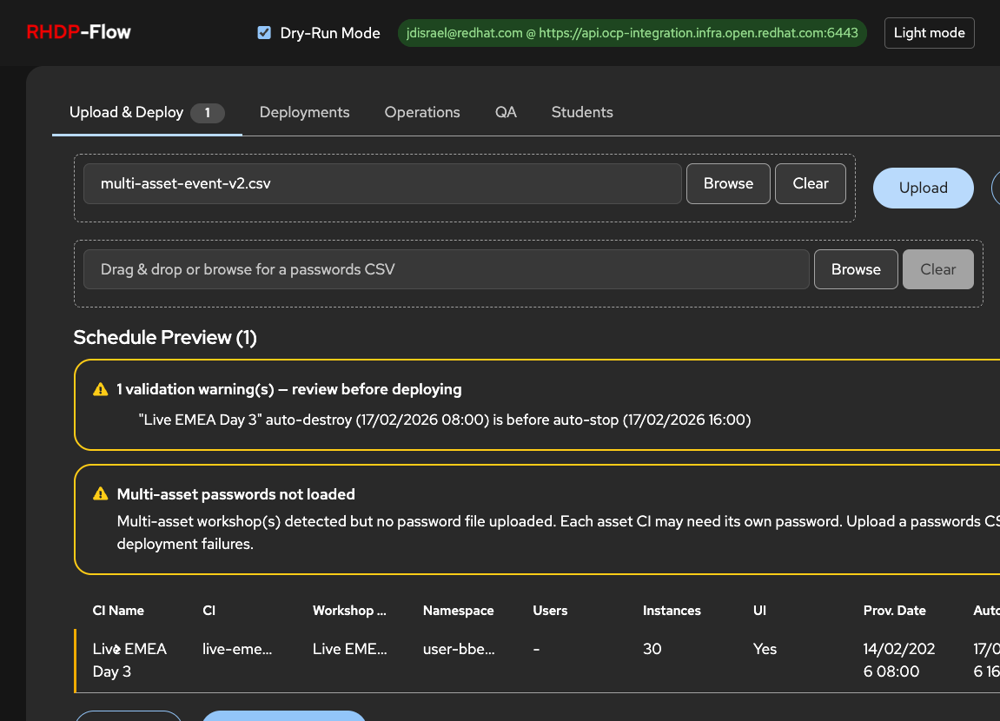
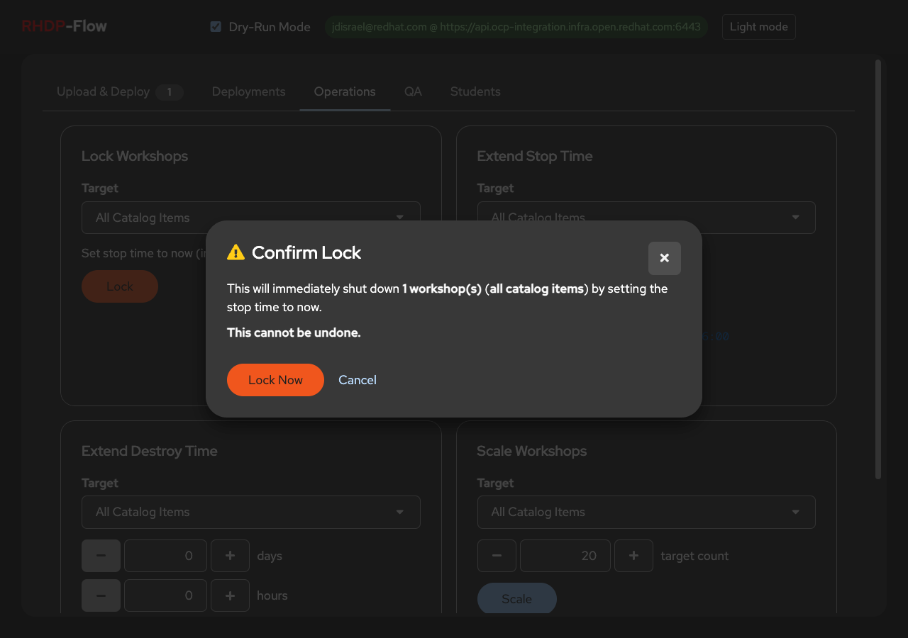
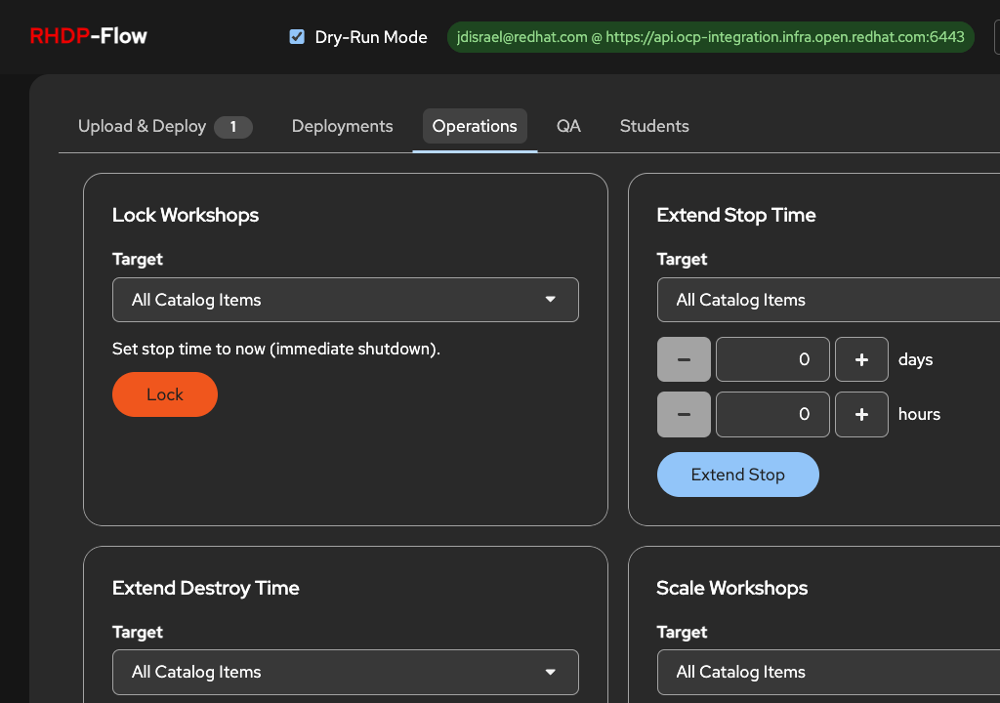
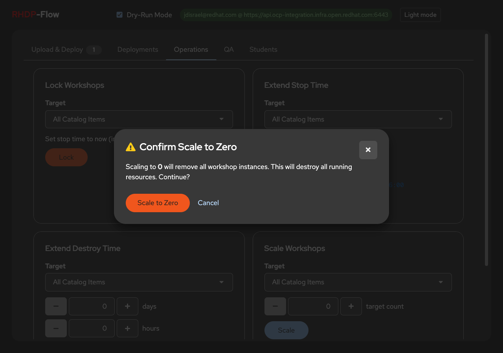
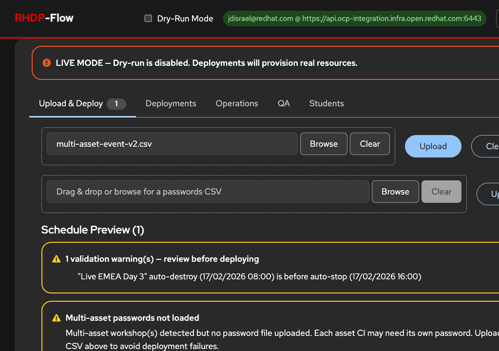
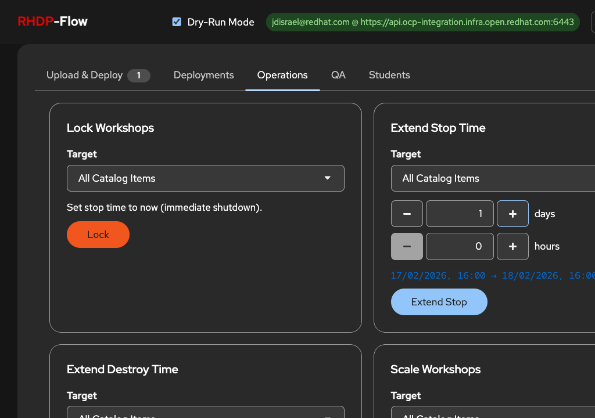
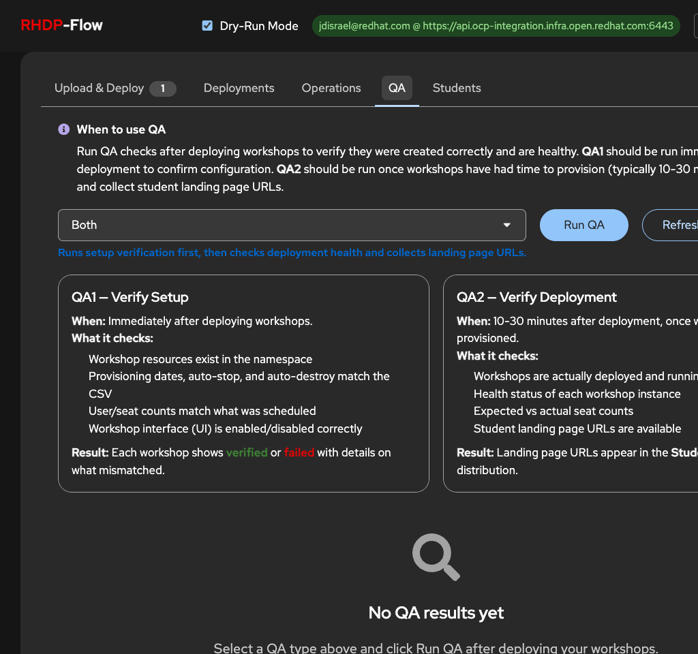

# RHDP-Flow Risk Prevention Features

Safeguards built into the RHDP-Flow UI to prevent user errors during workshop scheduling, deployment, and lifecycle management.

---

## Screenshots

All screenshots are in [`docs/images/`](images/) and show the features described below in action.

| Screenshot | Feature |
|-----------|---------|
| [01-upload-empty-state.png](images/01-upload-empty-state.png) | Initial UI with drag-and-drop file upload |
| [02-upload-validation-warnings.png](images/02-upload-validation-warnings.png) | Date validation warnings, multi-asset password warning, warning row highlight |
| [03-expandable-row-detail.png](images/03-expandable-row-detail.png) | Schedule preview with expandable row toggle |
| [04-expanded-row-detail-scrolled.png](images/04-expanded-row-detail-scrolled.png) | Expanded detail: password, activity, purpose, salesforce IDs, asset CIs |
| [05-live-mode-warning.png](images/05-live-mode-warning.png) | Red masthead border + LIVE MODE danger banner (Item 8) |
| [06-operations-tab-overview.png](images/06-operations-tab-overview.png) | Operations tab: Lock, Extend Stop/Destroy, Scale cards |
| [07-extend-stop-preview.png](images/07-extend-stop-preview.png) | Live date preview for extend operations (Item 11) |
| [08-lock-confirmation-modal.png](images/08-lock-confirmation-modal.png) | Lock confirmation with workshop count and scope (Items 4, 7) |
| [09-scale-to-zero-warning.png](images/09-scale-to-zero-warning.png) | Scale-to-zero confirmation modal (Item 6) |
| [10-qa-tab-guidance-cards.png](images/10-qa-tab-guidance-cards.png) | QA tab: info banner, blue hints, QA1/QA2 explanation cards (Item 13) |
| [11-deployments-summary-cards.png](images/11-deployments-summary-cards.png) | Deployments: summary cards, search, status filter, auto-refresh |
| [12-deployments-light-mode.png](images/12-deployments-light-mode.png) | Light mode theme view |
| [13-deploy-settings-toggles.png](images/13-deploy-settings-toggles.png) | Deploy settings: Resource Lock, Resource Pools, White Glove toggles |

---

## Implemented

### 1. Date Validation Warnings (HIGH)

**Risk:** Deploying workshops with past dates, unparseable dates, or auto-destroy before auto-stop causes incorrect resource lifecycles.

**Safeguard:** After CSV upload, the schedule preview automatically validates all date fields and displays inline warnings:

- **Past provisioning dates** flagged with specific date shown
- **Auto-destroy before auto-stop** flagged as contradictory lifecycle
- **Unparseable dates** flagged with the raw string so user can correct the CSV
- **Missing dates** flagged (provisioning, auto-stop, auto-destroy)
- Affected rows highlighted with a yellow left border in the preview table

### 2. Multi-Asset Password Warning (HIGH)

**Risk:** Multi-asset workshops require per-asset passwords. Deploying without uploading a password file causes silent failures.

**Safeguard:** When multi-asset schedules are detected and no password file has been uploaded, a prominent warning banner appears above the schedule table:

> "Multi-asset workshop(s) detected but no password file uploaded. Each asset CI may need its own password."

### 3. Enriched Live Deploy Confirmation (HIGH)

**Risk:** User clicks Deploy without realizing the scope (e.g., 50 workshops instead of 5) or that unresolved warnings exist.

**Safeguard:** The live deployment confirmation modal now includes:

- Full list of schedules to deploy (CI name, CI, namespace, instance/user counts, multi-asset flag)
- Warning count if any validation warnings are unresolved
- Scrollable summary for large schedule sets

### 4. Confirmation Modals for Destructive Actions (HIGH)

**Risk:** Accidental live deployments or session clears destroy work.

**Safeguard:**

- **Live deploy:** Confirmation modal required when dry-run mode is off (does not appear for dry-runs)
- **Clear session:** Confirmation modal warns that all schedules, results, and logs will be archived
- **Lock workshops:** Confirmation modal warns this immediately shuts down workshops and cannot be undone

### 5. Loading States on Operations (MEDIUM)

**Risk:** User double-clicks operations buttons, triggering duplicate requests.

**Safeguard:** All operation buttons (Lock, Extend Stop, Extend Destroy, Scale) show loading spinners and are disabled while the request is in-flight.

### 6. Scale to Zero Warning (MEDIUM)

**Risk:** Scaling to 0 instances destroys all workshop resources. The number input currently allows 0 without confirmation.

**Safeguard:** When the user sets the scale target to 0 and clicks Scale, a confirmation modal appears warning that this will remove all workshop instances and destroy all running resources. The user must explicitly confirm before the operation proceeds.

### 7. Lock Scope Visibility (MEDIUM)

**Risk:** User locks "All Catalog Items" when they intended to lock a single CI, because the confirmation modal does not show how many workshops will be affected.

**Safeguard:** The lock confirmation modal now displays:

- The exact number of workshops that will be affected (e.g., "3 workshop(s)")
- The CI filter value being applied (or "all catalog items" if no filter)

### 8. Dry-Run Mode Visual Distinction (MEDIUM)

**Risk:** User forgets they toggled off dry-run mode and accidentally deploys live.

**Safeguard:** When dry-run is disabled (live mode), two visual indicators appear:

- **Persistent danger banner** below the masthead: "LIVE MODE — Dry-run is disabled. Deployments will provision real resources."
- **Red bottom border** on the masthead bar, making the mode change immediately visible

### 9. CSV Row Skip Reporting (MEDIUM)

**Risk:** Some CSV rows fail to parse (bad values in Users, Instances, Concurrency) and are silently dropped. User sees "Loaded 7 schedules" but uploaded 10 rows.

**Safeguard:** The upload endpoint now returns `total_rows` and `skipped_rows` counts. When rows are skipped:

- Toast message shows "Loaded X of Y row(s) — Z row(s) skipped"
- A danger alert appears above the schedule preview explaining that some rows could not be parsed

### 10. Blank Field Visual Flags (MEDIUM)

**Risk:** Rows with missing passwords, blank activity/purpose fields, or empty optional fields are not visually distinguished.

**Safeguard:** The validation system now flags rows with:

- Missing passwords
- Blank Activity fields
- Blank Purpose fields

These appear as warnings in the validation summary alongside date warnings, with affected rows highlighted.

### 11. Extend Operations Preview (LOW)

**Risk:** User extends stop/destroy time without knowing the current values, leading to unintended schedules.

**Safeguard:** When the user enters days/hours for Extend Stop or Extend Destroy, a live preview appears below the inputs showing:

- The earliest current date for the affected workshops
- The computed new date after the extension is applied
- Format: `DD/MM/YYYY HH:MM → DD/MM/YYYY HH:MM`
- If multiple workshops are affected, indicates "(earliest of N)"

### 12. Operations Audit Trail (LOW)

**Risk:** No record of lock/extend/scale operations after page refresh.

**Safeguard:** The operations history table is now persisted to `sessionStorage`. Records survive page refreshes within the same browser session, preserving the audit trail of all lock, extend, and scale operations with timestamps, targets, and outcomes.

### 13. QA Tab Guidance & Type Descriptions (LOW)

**Risk:** User runs wrong QA check because QA1 vs QA2 purpose is unclear, or doesn't understand when/why to use QA at all.

**Safeguard:** The QA tab now provides multiple layers of guidance:

- **Info alert banner** at top explains when to use QA: QA1 immediately after deployment, QA2 after 10-30 minutes
- **Contextual blue description** below the QA type dropdown updates as the user changes the selection, using a visible blue color instead of muted gray
- **Two explanation cards** (visible when no results exist) detail each QA type:
  - **QA1 — Verify Setup:** When to run, what it checks (namespace resources, dates, seats, UI config), expected result
  - **QA2 — Verify Deployment:** When to run, what it checks (health, running status, seat counts, landing URLs), expected result

---

*All risk prevention items implemented.*

*Last updated: 2026-02-11*
